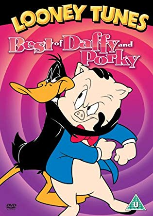

# Bonus Exercise - Looney Tunes</span>

<span style="color: red;">This is Part 2 of Funny Talk.</span>



### Daffy Duck Speech

You are going to translates normal english text into the speech of Daffy Duck which we will call `daffify`.  Your method will take in a string and replaces all the "s" characters with "th".

Example:

```ruby
daffify("This is ridiculous") == "Thith ith ridiculouth"
```

# Research

Use RegEx combined with `#gsub` or `#split` from the [String default methods](https://ruby-doc.org/core-2.4.0/String.html) to solve the following problems.


## Commit 1 - Pseudocode for Daffy Duck Speech

For the method `daffify`, write down the input and the output (data type and example of each, EX: Array of Integers, [1,2,3,4] ) 

Then write a list of steps to complete the task in plain English and be precise in your explanation. You are solving a logical problem, not describing the methods that you will use.

## Commit 2 - Initial Solution

Write your initial solution for `daffify` in the `daffy_solution.rb` file

## Commit 3 - Write Runner Code / Tests

Add runner code or multiple tests for `daffify`, like this example:

```ruby
puts daffify("This is ridiculous") == "Thith ith ridiculouth"
puts daffify("That's why I always work solo") == "That'th why I alwayth work tholo"
puts daffify("Such a sourpuss") == "Thuch a thourputh" # bonus, needs more logic
```

<div style="margin: 60px;"></div>

***


***


# Big Bonus - Porky Pig Speech

The bonus is to translate normal English text into the cadence of Porky Pig, called `porkify`.

[Bob Bergens](https://www.youtube.com/watch?v=lXC_j5QB6v8), the current voice of Porky Pig did an interview for the documentary "I know that Voice", where he says that there is a formula to talking like Porky. The key is four sounds followed by the word, with an emphasis on the third sound for all nouns. Write a method that takes a word and creates the following pattern from that word:

```ruby
"boy" -> "eh buh BEH eh boy"
"chair" -> "eh ch CH eh chair"
"desk" -> "eh duh DEH eh desk"
```

The pattern is easy to work out. The second and third sounds are the first two letters of the word unless the second letter is a vowel. In that case, it is the first letter followed by "uh" and "eh". He doesn't stutter on words other than nouns or nouns that begin with a vowel. The third sound must be capitalized.

Later we can access the entire list of words from our message using an API to check if they are nouns. For now, you can include a dictionary (an array of words that you build for testing) of appropriate nouns you want replaced within the sentences for your runner code.

Example:

```ruby
dictionary = ["this", "place", "tomorrow", "rust"]

puts porkify("this is a nice place", dictionary) == "eh th TH eh this is a nice eh pl PL eh place."
```

## Bonus Commit 1 - Pseudocode for Porky Pig Speech

For the method `porkify`, write down the input and the output in the `porky_solution.rb` file

Then write a list of steps to complete the task. Try writing out your list then verify your steps are in the best order before translating your pseudocode into ruby.

## Bonus Commit 2 - Initial Solution

Write your initial solution for `porkify`

## Bonus Commit 3 - Write Runner Code / Tests

Write runner code or tests for `porkify`

## Bonus Commit 4 - Refactor

Comment out the initial solution. Copy and paste your method to the `Refactor Solution` section and clean up your code so it is written more cleanly, is more readable, or is broken down into smaller single-purpose methods.

## Bonus Commit 5 - Find All Nouns

This will definitely take some research. See if you can find a Ruby gem, library, or API (example: [wordnik](https://developer.wordnik.com/docs#!/word/getDefinitions)) that can identify all nouns within a sentence.

<div style="margin: 60px;"></div>

***
***

## Bonus Bonus - Pig Latin: Master translator

Create a new Ruby file called `pig_latin_solution.rb` in the `looney_tunes` folder. Set up your own Pseudocode, Initial Solution, Runner Code and Refactoring to write one method that converts a string into Pig Latin and another that converts Pig Latin into plain English to send coded messages. Use your Regular Expressions.

The rules for Pig Latin are listed [here](http://en.wikipedia.org/wiki/Pig_Latin). You know what to do!

# Udyra ancay ebay unfay

