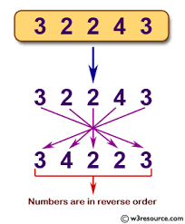
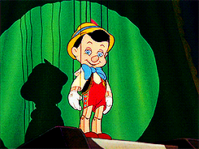

# Exercise - Reverse a Number

This is Part 2 of Manipulating Numbers.

It's time to be a mob accountant and juggle some numbers. We want to write a method that accepts an integer such as `12345` and returns an integer of `54321`.

- Your input will be an integer greater than 10 that doesn't end in a zero.
- Your output will be an integer where the numeric characters are reversed.

There are several ways to solve this problem, and we will try two distinct approaches.

# Research

Familiarize yourself with some String and Integer methods. When thinking through this problem, really explore some options before deciding on a plan of attack. Don't rush.

  - [String](https://ruby-doc.org/core-2.4.0/String.html), we are asking you to not use the `#reverse` method for this exercise.

  - [Numeric (Integer inherits from this)](https://ruby-doc.com/docs/ProgrammingRuby/html/ref_c_numeric.html), we are asking you to not use the `#divmod ` method for this exercise.

  - [Arithmetic Operators](https://www.w3resource.com/ruby/ruby-arithmetic-operators.php)

# Commit 1 - Pseudocode

Write down your input and output with the data types (EX: String, Integer, Array of Integers, etc.) that your method could accept and then list specific examples of input data and each expected output.

Write your steps in plain English. It is very important to not specify the data types or the methods that you will use within the method to accomplish your goal. In this way, your pseudocode can be used for both solutions.

Note: Do not use the String#reverse method. The goal is to write the code in more detailed steps on your own.

# Commit 2 - String Solution

The first approach we will take involves converting the number into a list of numeric characters, then reversing the characters, and finally converting the string of reversed characters back into an integer. Note: Your pseudocode should be more specific than this and written in plain English. Again, don't use the reverse method.

Write your initial solution and make the tests pass. 

# Commit 3 - I've Got No Strings

<!---->

Play Gif

Rewrite your method in the `No Strings Solution` section without ever using a string within your logic. Hint: It may be helpful at some point to make a second method, but that method cannot contain strings either.

Hopefully, your pseudocode doesn't need to change too drastically if it's truly free of code syntax. Don't get worried about the math involved. Concentrate on isolating each number before changing the order.

# Commit 4 - Refactor Solution

Refactor your "No Strings" version of the `reverse_a_number`

