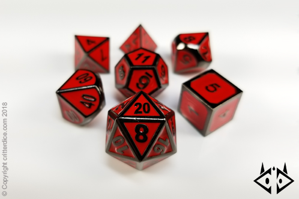

<link href="https://fonts.googleapis.com/css?family=Charm" rel="stylesheet">
# Exercise - D & D Digital Dice

If you've ever played D&D (Dungeons and Dragons), you'll love this challenge. Even if you have never played D&D, you'll still love this challenge. But either way, you must submit to the Glory of my 20th level, Epic Devil-Skin-Drow Wizard named, <span style="font-family: 'Charm', cursive; font-size: 1.5em; color: #BB0055;">Whygg Oodwy!!!</span>


D&D is a game where you will need to roll a variety of dice. In this challenge, you are writing code to represent a physical object, namely a die. 

Making a class is making a factory to produce objects. When I say `object`, I'm referring to a coding concept that represents a collection of attributes and behaviors. 

- You could think of an attribute as "what an object is". For example: How many `sides` a die has. That describes what a specific die is. It may be a 6-sided die or a 20-sided die. 
- You could think of a behavior as "what an object can do". Such as a die can `roll` - whose logic/action would change the side facing up.

> An attribute can also refer to the current state of an object, that is - what the object is at a given moment in time. ex: which side is currently facing up.


We will start with a basic `Die` class which can be initialized with any number of sides. We then want to roll the die, returning a random integer.

# Research

Look through your notes on making classes in week 1 lecture if you need to review. You should be able to answer the following questions before tackling this challenge.

1. What is the syntax for defining a class?
2. What is the syntax for defining an instance method?
3. How do you create an instance of a class?
4. What is the purpose of the `initialize` method?
5. What is the purpose of `reader` and `writer` methods?
6. What type of variable holds an attribute for one instance of a class?

>Note: You may see the term "instantiate", which means to "create an instance of a class". The terms "instance" and "object" are interchangeable.

If you need to dive further into Object Oriented Programming at a later time, I would suggest the very popular book, [Practical Object Oriented Design in Ruby](http://www.poodr.com/) also known as POODR (poo-der).

# Commit 1 - Pseudocode

You should write pseudocode for each method. Some of these will be very short as far the number of steps they contain.

- List the methods that you want to write. Hint: You know of at least three - `sides` (reader), `roll` and `initialize`
- Ask yourself, "What data do I need to run each method?" This may not be an argument passed into the method. It may be stored in an instance variable instead. But it's important to note what data will be needed to run your logic within the method.
- What data type do you expect to be returned by your `roll` method (is it a string, integer, array, hash, boolean, etc.)? Does it change an attribute but not provide a  return value? If you do not have an expected output, you should instead describe the effect you expect to happen.
- Write out the steps for each method in your class in plain English. You are probably getting pretty good at that by now!

# Commit 2 - Initial Solution

Start by writing your class with an `Die#initialize` method. Set up your attributes as instance variables and then write your other methods.

You should refactor when or if your code gets to complicated. Find specific moments to focus on refactoring as you work through this code.

# Commit 3 - Write Runner Code / Tests

Example:

```ruby
noraml_die = Die.new(6)
noraml_die.sides # returns 6
noraml_die.roll # returns a random integer, 1 - 6
```

Write runner code for all the dice in your D&D collection. 4 sided, 6 sided, 8 sided and/or 20 sided dice. Make a few dynamic examples.

# Commit 4 - Make A Bag of Dice

In D&D, you would normally take multiple dice and throw them at once. An example of a single throw with multiple dice could include all the dice in the bulleted list below.

- 4 instances of a six-sided die
- 1 instances of a twenty-sided die
- 2 instances of an eight-sided die
- 4 instances of a four-sided die. 

Is there a way to write a method outside of your 'Die' class that would take assorted number of dice of various sides and roll them all at once? Could you make another method for a throw that references the `Die` class? The best way to do this is a second class called `DiceCup` that <span style="color: red">IS</span> "a collection of dice". 

>Subtle Hint: How do you define what an object is? \**wink wink*\*



# Bonus 1 - Add A Custom Error

When we initialize `Die.new` with a number less than `1`, we should raise an `ArgumentError`.  This is done using the `raise` keyword.  See the [ArgumentError documentation](http://apidock.com/ruby/ArgumentError) for details on how to implement this. This will help your user use your code the way it is intended.

- [Short Description for Custom Errors](http://blog.honeybadger.io/ruby-custom-exceptions/) 
- [Long Description for Custom Errors](https://rubymonk.com/learning/books/4-ruby-primer-ascent/chapters/41-exceptions/lessons/91-tidying-things-up)

# Bonus 2 - Build Yatzee

Build a Yahtzee game for the terminal. Make another class called `Game` that allows you to start a game, keep track of your score sheet, document scores, roll all the dice in your cup, hold certain dice and reroll, check if a roll is accepted etc. The rules are [Here](https://www.wikihow.com/Play-Yahtzee). I recommend that you start with only one player first.

