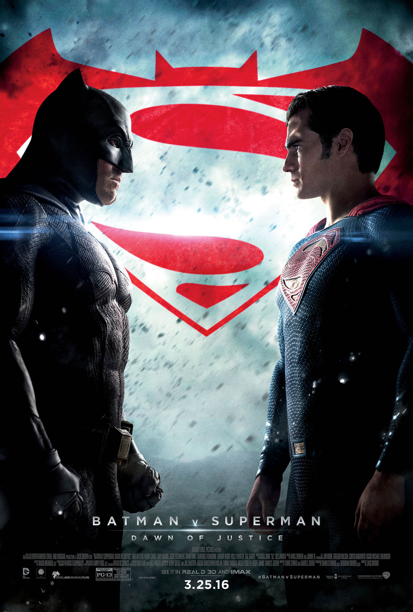
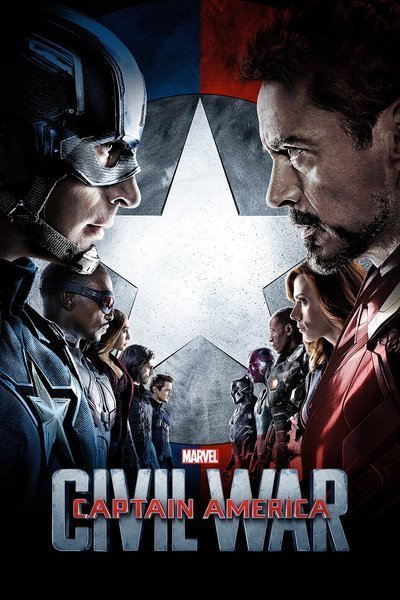

# Exercise - Modeling Superhero Fight

Whether you enjoyed or hated the [Batman vs. Superman](https://www.imdb.com/title/tt2975590/) movie that came out in 2016, it presents an interesting study in Object Oriented Programming (OOP). The idea is to create one `Superhero` class that will represent both an object representing `batman` and an object representing `superman`.

### Superheros Have Attributes 

- `name` (string, readable), 
- `hitpoints` (integer, writable), 
- `attack` (integer), 
- `alive` (boolean, set automatically as true, writable), 
- `has_special_tool` (boolean, to describe if they have a `special_tool`, set automatically as false, readable)

>For each attribute above, you can see that I've put a suggestion next to the attribute. It recommends making it a reader method or a writer method for minimal functionality, but you decide if that attribute needs to be readable/writable.

### Rules

The rules of this exercise is to follow the `Runner Code / Tests`. You should not change the runner code as it will direct you to what is required.

#### Hints

- Notice that the attributes are passed into the object as a single hash
- For the class `Superhero`, objects will interact with other `Superhero` objects by passing them into a method argument. To see how they are passed into an argument, check the runner code.
- Superheros can hit, so they need a `hit` method that takes away hit points from another Superhero object, by the number of attack. Again, check the runner code for reference.
- If a Superhero has a `special_tool`, their attack attribute is tripled.
- If a Superhero is attacked and their `hitpoints` become less than 1, they are no longer `alive`.
- A `Superhero` needs a `grab_tool` method that sets the `has_special_tool` attribute to `true`.

# Research

Look through your notes on making classes and Object Oriented Programming if you need to review.

# Commit 1 - Pseudocode

You are writing multiple methods within a class. Your pseudocode should include a list of all the methods that you intend to write. The list doesn't have to be complete to start; you can always adjust your pseudocode later.

### For Each Method 

- Use the runner code to assess which methods and features are required.
- Write what information is needed for the method to work. This may be an argument passed into the method, but it may be an instance variable that the method has access to.
- Write what you want the method to do. Specify whether it changes an attribute's value, prints a message to the terminal, returns a value (output), or any other desired result.
- Write down the list of steps for each method.

# Commit 2 - Solution

Build your `Superhero` class to make the runner code function correctly.

***
***

# Big Bonus Commit 1 - Marvel's Civil War

You can add to your `Superhero` class to model the fight between the epic battle between superheros of the [MCU - Marvel Cinematic Universe](https://en.wikipedia.org/wiki/Marvel_Cinematic_Universe). 

You are building the battle in [Captain America: Civil War](https://en.wikipedia.org/wiki/Captain_America:_Civil_War). Comment out the code that you've written so far, then copy and paste your `Superhero` class in the `Civil War Solution` section at the bottom of the solution file. 

>Note: The restraints are off, you can add or subtract any attributes or methods in order to model this new scenario. You will need to write some additional pseudocode first before diving deeper into this exercise. Go through the list below and analyze: What is similar between the heroes? What's different? Maybe try using Mixins (Modules) to handle different abilities. The idea is to make this your own.

In the movie, there is a battle between two teams of "good guys" because of reasons that you'll have to see in the movie. No Spoilers. If you haven't seen the movie that's ok; just play around with more superheros using the lists below to to get an idea of more superheros and different powers. Here's the list of characters from the "Civil War" movie, their powers and which side they are on. 

Copy and paste the `Superhero` class into the `civil_war_bonus_solution.rb` to start developing your battle.

>#### Captain America's Team

>- `Captain America` has a shield that he throws; he's super strong and fast
>- `Winter Soldier` has a metal arm and is super strong (can hit really hard), can be turned by brainwashing (optional)
>- `Falcon` flies, shoots hand guns
>- `Hawkeye` shoots arrow (that can explode or stun)
>- `Scarlet Witch` can hold people preventing them from action for a turn, shoots energy
>- `Ant-Man` can grow (hits hard) or shrink (hard to hit)

 

>#### Iron Man's Team

>- `Iron Man` has a suit of armor, shoots rockets, flies, super smart
>- `Black Widow` has super agility (back flips, jumping, dodging), fast healing, shoots hand guns
>- `War Machine` has a suit of armor, shoots rockets (more damage than iron man), flies
>- `Black Panther` has super agility and a special suit that lessens damage
>- `Vision` can let hits go right through him at times and shoots a laser from his head
>- `Spider-Man` has agility and shoots spiderwebs

Write a battle in the `Civil War Runner Code`. You can even randomize the order of attacks. Decide how you want to visually see this battle in the terminal.

#### Recommendation for bonus

Track the players by making a `Team` class with an attribute of `heroes`. `heroes` should hold an array of `Superhero` objects. You can then make a method that picks the next player. This can rotate through the `heroes` list or randomly select the next person to attack or be attacked. If you have some way of tracking how many times a particular `Superhero` has been played you can make sure it's not 100% random.

