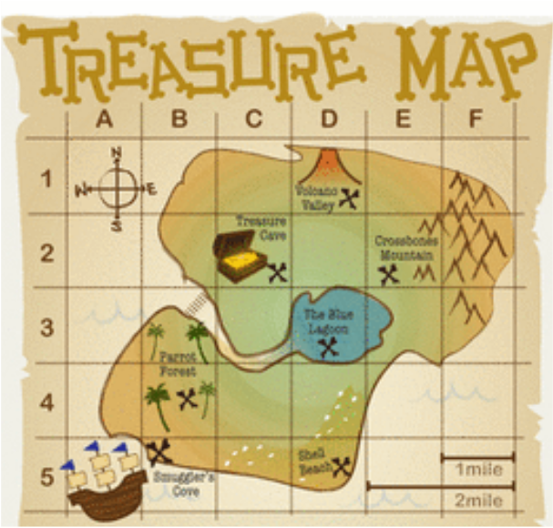

# Exercise - East Egg Hunt


That old floppy-eared friend has come to town once more and he's littered your yard with eggs. We'll be writing some code to pick up the bright-colored-and-hard-boiled debris so your yard doesn't stink next week.

Your yard map is represented by a nested array, like this: 

(example a)

```ruby
yard = [["G","E","G"],
        ["G","G","G"],
        ["E","G","G"]]
```

The "E" represents an egg, while the "G" represents plain grass.

### Requirements

1. Write a `clean_yard` method that calls shorter single-purpose methods. 
2. Your yard map should be 14 spaces wide and 11 spaces top to bottom.
3. Searching through the map, find the eggs represented by an "E" string.
4. Collect the eggs into the `basket` variable.
5. Keep track of the coordinates of each egg.
6. Replace the torn-up yard divots where the eggs have been by replacing the Egg location with a patch of grass represented by a string of "G".
7. Print the yard to see updates as eggs are being collected.

    >You get to decide where the eggs go in your yard, but an example would be something like this:

    ><pre>
    G  G  G  G  G  G  G  G  E  G  G  E  G  E
    G  G  E  G  G  G  G  G  G  E  G  G  G  G
    G  G  G  G  G  E  G  E  G  G  G  G  G  G
    G  G  G  E  G  G  G  G  G  G  G  G  G  G
    G  E  G  G  G  G  G  G  G  G  G  G  G  G
    G  G  G  G  G  G  G  E  G  G  G  G  E  G
    G  G  G  G  G  G  G  G  G  G  G  G  E  G
    G  G  G  G  E  G  G  G  G  G  G  G  G  G
    G  G  E  G  G  G  G  G  G  E  G  G  G  G
    G  G  G  G  E  G  G  G  G  G  G  G  G  E
    G  G  G  G  G  G  G  G  G  G  G  E  G  G
    </pre>

    >If you need help, look at [this example](examples/print_grid_example.rb) for how to print a grid.

8. Once the yard has been cleaned, print a report to the terminal that the yard is clean and "up to code" with the homeowner association.  
9. The report should include a count of the found eggs. This will also help us make sure we didn't miss a hard-to-find egg.

You should expect a report similar to this: (Pay attention to spacing for a clean report.)

```
*************** Yard Report ***************

  Yard: Clean
  Divots: Replaced

  Total Eggs Found: 13

  Eggs found at the following coordinates
  ---------------------------------------
             col: 0  - row: 8
             col: 0  - row: 11
             col: 0  - row: 13
             col: 1  - row: 2
             col: 1  - row: 9
             col: 2  - row: 5
             col: 2  - row: 7
             col: 3  - row: 3
             col: 4  - row: 1
             col: 5  - row: 7
             col: 5  - row: 12
             col: 6  - row: 12
             col: 7  - row: 4
             col: 8  - row: 2
             col: 8  - row: 9
             col: 9  - row: 4
             col: 9  - row: 13
             col: 10 - row: 11

  Sir or Madam, 
  Your Yard is safe for Horseshoe,
  BBQ's, Beanbag-toss and the like. 
  See you next year, Rabbit.

*******************************************

```

<br>

# Commit 1 - Research

### Nested Arrays as a Grid



Looking at "example a" above, we can think about the nested array as a map. There is an x coordinate finding a column (side to side) and a y coordinate finding a row (up and down). Our coordinates start in the top left corner of the map.

```ruby
p yard[0][1] #=> "E"
p yard[2][1] #=> "G"
```

Use this concept of a nested array as "map coordinates" to read and affect your yard data. 

>Note: Do not use `flatten` on the yard as that will destroy your coordinate system.

### Attractive Report

You get to decide the format of the report. Look at string methods on [ruby-doc.org](https://ruby-doc.org/core-2.4.0/String.html) to create a user-friendly report.

Answer these questions with an English explanation in your solutions file.

1. Explain the use of the following methods `ljust`, `center`, `rjust`.
2. What does this code do? `puts "*" * 8`
3. What does this code do? `puts ""`

# Commit 2 - Pseudocode

List all methods that you may need to build for this exercise. Any supporting methods can be called inside the `clean_yard` method. Plan your steps for each of these methods. At least, you will need very specific pseudocode for the following tasks:

- Looping through a nested array
- Generating your report
- Replacing the divots (changing eggs to patches of grass)

# Commit 3 - Write Runner Code

Create your yard as a nested array in a variable and pass it into your `clean_yard` method.

>You can write runner code for individual support methods by passing in a similar data type.

# Commit 4 - Initial Solution

Create an initial solution for the `clean_yard` method and any supporting methods that will assist the `clean_yard` method.

>Use `p` statements in your code to help with debugging, and `puts` for user-friendly printing.

# Commit 5 - Refactor Solution

Copy and paste your initial code in the `Refactor Solution` section and clean it up.

# Bonus

Make your eggs colored with this [example](examples/colorized_example.rb)

