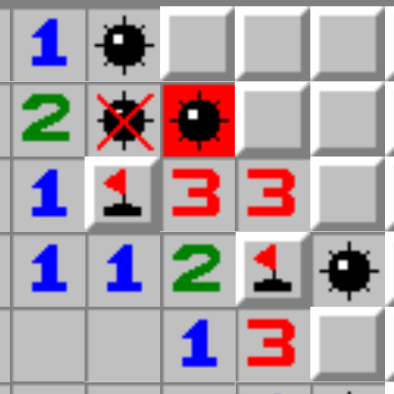

# Exercise - Mine Sweeper (Part 1)

You will work on this exercise for multiple days. Finish as much as you can today so you can add to it tomorrow.

You have the task of creating the classic [mine sweeper](https://itunes.apple.com/us/app/minesweeper-deluxe/id657011614?mt=12) game in your terminal.

 

# Research

## Nested Arrays and Nested Hashes

Go back to the Easter Egg Exercise if you need to review how to model a map or grid using nested arrays. 

>Note: You could also use nested hashes or a nested combination of arrays and hashes.

 

## Animation

##### Animation Basics

- Animations are a [series of pictures](https://www.youtube.com/watch?v=V8A4qudmsX0&feature=youtu.be) 
- You can see an [animation example in Ruby](examples/animating_example.rb)

We are not going to worry about frame-rates and constant movement but it is important to get the idea that we are producing a series of images (a.k.a. formatted printed characters in the terminal). Each image replaces the previous one by clearing the screen between prints and that makes the game look like it's one game board with elements moving around on it. In reality, we are removing one image and drawing a brand new image to take its place.

##### Animation In Code

There are two very important methods for coded animation:

- the `update` method
  - changes the state of the application's data (what is visible, where focus is, what message should be displayed, etc.)
- the `draw` method
  - resets the screen so the next printed image appears to be in the same location; a small change will be perceived as movement to the human eye
  - displays the current state of data, like a snapshot
  - prints the data in a format that is user friendly, giving the user what they need to play each moment of the game

Again, this is not constant movement, so you do not need to worry about frame-rates.

##### The dup method

If you did not get to the bonus exercise on destructive methods, you'll need to research object id's and the `dup` method. This can make a "photocopy" of your data, so you make a small change on the cope and print it without changing the origin data. This will help for the additional features in the next exercise.

Follow [this object id example](examples/object_id_example.rb). Copy sections into irb to see how they work.

 

### Required Methods

1. `clear_sreen!` - which does not need to be altered
2. `update` - to change the data
3. `draw` - to display the data
4. `run_program` - loops between `update` and `draw`, with a conditional to end the program.

In addition you will want these two methods.

1. `analyze_board` - to run one time in initialize, this will fill in the numbers.
2. `print_formatted_board` - to format your board

This is a large project and it is very beneficial to break it down into smaller sections. It is up to you how detailed this needs to be for each method.

As you complete a large section of code or a single method and get it to run correctly, you should periodically take a moment to refactor before moving forward. As your app gets bigger it will become more difficult to move forward unless your code is clean.

 

# Commit 1 - Planning

This is more broad than pseudocode.

- When planning an app, you can use "coding" words. 
- You should make a list of features that you want to create.
- You should make a list of methods and their intended purpose.
- Prioritize what needs to happen first, second, third, etc.

You do not need to know every line of code you plan to write before you start programming. You need to find a balance between a strong game plan and managing your time so you can complete the project.

>Note: You can use characters such as `B` for a bomb and `X` for a hidden space. We can jazz it up later, but for now stay with simple characters.

 

# The App

## Commit 2 - Basic Game

Your application will...

- Draw an 8 x 8 grid of hidden values
	- A hidden value can represent a bomb, a number, or be blank.
	- You should start by hard coding where the bombs are located but create a method that documents the numbers (representing the number of surrounding bombs if the space should display a number). This method should run once at the begining of the program.
- Allow a user to select a square by typing in x, y coordinates
  - If the user selects a square that is a bomb, they lose and the game ends.
  - If the user selects a square that is not a bomb it will display the number of bombs next to that square.
  - If the user selects a square that is not a bomb and not adjacent to a bomb it will appear blank.
- If a user uncovers all the squares that are not bombs, they win and the game ends.
- When the game ends, display a closing message that tells the user if they won or lost.

## Commit 3 - Marking Squares

Add the ability for a user to mark a square

- If they think it is a bomb, they should be able to mark it with a character reminding them not to click on that one. I recommend `F` for flag but you can choose any character.
- If they are questioning whether a square might have a bomb, they should be able to mark it with a character reminding them to come back later in the game.
- Marking a square should restrict a user's ability to click on that square by accident.

## Commit 4 - Check Surrounding Squares

Check surrounding squares

  - A user can check all 9 squares at once, that is, the one they've selected plus the eight surrounding squares.
  - If there are marked squares within the 9 square block being checked, it should not be affected. This feature will only check the remaining unmarked hidden squares. 

  
## Bonus

1. Add a start screen before starting the game

   >Suggestion: Do some research and add some ASCII art to your start screen and closing message.
   
2. In the closing message
	- display how many bombs were on the map.
	- display how much time it took to play the game.