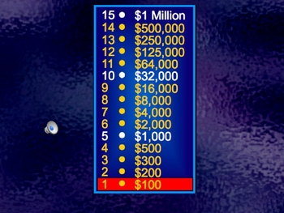
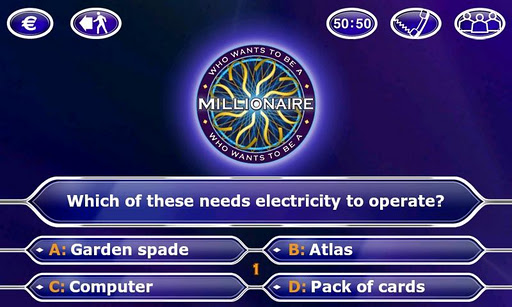

# Exercise - Who Wants To Be A Millionaire?

<span style="color: red;">This is a two day project</span>

The game show has been around since 1998. A player must go through a ladder of multiple choice questions to win the grand prize... "ONE MILLION DOLLARS!!". That's right, you will win a string with those rewarding words in it, printed right to your terminal.

### Requirements

1. The Game has a list of 15 questions, each have a correct answer and 3 wrong answers.
2. Start the game and enter your name <br><br>
3. The player sees a question and 4 possible answers. Only one answer is correct. <br><br>
4. The player presses A, B, C, or D to answer the question. That answer is marked as selected.<br><br>
  4 a. The player then has to confirm, "Is that your Final Answer?" answering "Y" for yes or selecting a different answer. They can keep clicking on different selections until they confirm the final answer.
  
  >Note:  We will hold off on lifelines until the bonus.
  
5. When the correct answer is selected and they confirm, a success message appears and points are added to their total. The player is asked if they want to continue on or walk away with their current points. <br><br>
  5 a. If they choose to walk away, they will see a congratulations page telling them how many points they bring home and asks if they want another game. <br><br>
  5 b. If they choose to "keep going", they go back to step 3 with a new question/answers and repeat the process. <br><br>
6. If a player confirms an incorrect answer, they will see a page telling them the correct answer to the question and a message of "Thanks for playing, but you go home with 0 points". Then the program asks them if they wish to play again. <br><br>
7. If a player answers correctly all the way up to the "Million Dollar Question" (the 15th question), they get a special page that shows they've won a million dollars and go home a winner.



# Research

### MVC without Rails

MVC is a design pattern used in Rails by convention. When you are building other applications from scratch you can configure according to what best suits the app. However, you still want a strong structure to keep your code organized. In this exercise we are going to use the MVC pattern in a non-Rails application and build it from scratch.

#### MVC

- `M` - Model, The code that stores, structures and allows access to the "Data".
- `V` - View, The code that "interacts with the user", displaying messages and information as well as retrives input fromt the user for the application to use. (Anything you see in the terminal.)
- `C` - Controller, The code that manages the "flow of logic", usually <span style="color: red;">pulling together the Models and Views</span> to produce the desired functionality at a given time.

You can have multiple files of each file type. All model files should be in the models folder, and the controller and view files should be in their corresponding folders as well. You can run a main controller method in the `runner.rb` file; running this one file starts the program.

### Gemfile

What does it take to add a Gemfile? No magic, just four easy steps...

1. Create a new file called `Gemfile` in your application's root folder, in this case the `solution` folder
2. Add the first line `source 'https://rubygems.org'`
3. Add the gem
4. In the root folder, run `bundle install` (creating a `Gemfile.lock`)

Try adding one of the following coloring gems to your Gemfile. Then bundle inside the home folder of this app.

- https://github.com/fazibear/colorize
- https://github.com/janlelis/paint
- https://github.com/sickill/rainbow

If someone else downloads your game app, they would easily have all the required gems with the correct version to run your app.

### Sleep

The `sleep` method allows you to add a pause to your application. Run the following code for an example:

```ruby
puts "Everything is coming together nicely"
puts "Now let's play the waiting game"
sleep(2.0) # pauses 2 seconds
puts "..."
sleep(0.5) # pauses a half of a second
puts "ugh, The waiting game sucks"
puts "Let's play Hungry-Hungry Hippos"
```

# Commit 1 - Hide and Seek (MVC Primer)

I have given you an app in one giant class. View and run the [original code here](hide_and_seek_primer/hide_and_seek_runner.rb). Identify each method as a controller method, a view method or a model method. If it is a model method, you should also identify if it belongs to a Cat model, a Mouse model or a Room model.

Submit your answers in the [primer_answers.txt](primer_answers.txt) file.

Example 

```
Hides Controller
  
   Method Numbers: 34, 6, 9 # (this are wrong answers)
```

<span style="color: red;">Set timer for 30 minutes.</span> When the timer goes off, check the [answer key](hide_and_seek_primer/answer_key_dont_peek) folder and compare your answers.

# Commit 2 - Planning

Write the following in the [planning.txt](planning.txt) file:

1. Take 10 minutes to write down the features that you want to include in your app. This is probably going to be similar to the breakdown of the game above.
2. Take another 20 - 30 minutes to write down a series of events, or "flow of logic", to your app. This should include a list of methods for views and methods from models and their generic functionality. You can also write the order in which they should be called in the controller. 



# Commit 3 - Implementation

Build your application in the `millionaire_solution` folder. There is already a skeleton setup of:

- controllers folder (for your Ruby controller files)
- models folder      (for your model Ruby files)
- views folder       (for your view Ruby files)
- Gemfile            (to add gems to your app)

Create the files, classes and methods in the appropriate folders to complete a functional app following the MVC design pattern. Use the `require` or `require_relative` within a Ruby file to access code from other local files and gems.

### Write Runner Code in Runner File

Write runner code in the `runner.rb` file. The runner file should require all necessary files and call the method to start the application. In this application, the entire runner code should consist of this single line:

```ruby
GameController.new.run
```

Run your application from the `millionaire_solution` folder and type the command `ruby runner.rb`.

# Commit 4 - Evaluation

Assess any methods that could use refactoring. Identify which ones are worth your time and which ones are clean enough. Then refactor at least 2 or 3 methods.

Test the game out and reflect on what works and what could be improved.

# Bonus

If the player is unsure which answer to give, they are given 3 lifelines, one of each for the entire game. Note: For each lifeline, you may need to add information to the json file containing the questions and answers.

Lifeline 1: "50/50", this removes 2 incorrect choices.
Lifeline 2: "phone a friend", You will automate this. The game displays a message from a friend that is right 90% of the time, otherwise it's a another random answer.

# Bonus 2

Lifeline 3: "ask the audience", You will automate this. Track the answers that other people have given for each question. As someone answers each question, you will update the JSON file to say how many times each answer was picked. When someone picks "ask the audience" it will retrieve the percentage of each available answer and give those percentages to the player to help make a decision.

# Bonus 3 - JSON local File

You are not going to have a database to store data. Instead, you can store questions and anwsers in a local json file. 

>Note: This is a different use of json, this is not a view like in Rails, this is just a formatted text file to store data in a hash.

1. Include the `json` gem in your gemfile and bundle
2. Write to a json file. [Run this example to write](examples/write_to_json.rb) (See that a new json file has appeared)
3. Read from a json file. [Run this example to read](examples/read_from_json.rb)

Review [this blog](https://hackhands.com/ruby-read-json-file-hash/) for a closer explination.

>Note: You are probably writing to and reading from the json file in your controller. However you can only refer to json files from the origin ruby file's location. The json file should be located in the millionaire_solution file, the same folder where the runner.rb file starts the program.
