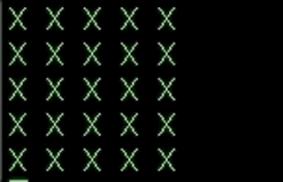
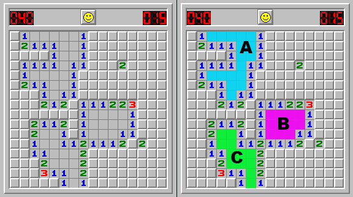

# Exercise - Mine Sweeper (Part 2)

<span style="color:red; font-size: 120%;">This is a continuation from the Mine Sweeper exercise from yesterday.</span>

You have the task of creating the classic [mine sweeper](https://itunes.apple.com/us/app/minesweeper-deluxe/id657011614?mt=12) game in your terminal.


# Research

Here are some concepts you may end up using today:

- Color in Terminal - [Example](examples/colorized_example.rb)
- `STDIN.getch` [Example](examples/io_getch_example.rb)
- Review the "Recursion" concept from the recursion exercise. What are the 3 "Recursion Musts"? You do not need to submit your answer as a commit. But you do need to know what is necessary in order to write a recursive method today.


# Planning

Similar to Mine Sweeper Part 1, the planning is up to you. When you write a new method, you can plan it out beforehand by... 

- Determining the purpose of the method
- Writing down what data is necessary to run your logic and what data is available within this method
- Writing down the return value or effect you want this method to accomplish
- Breaking down the logic into small steps

<br>

# App Continued

## Commit 1 - Color

Instead of typing in coordinates each time, try highlighting a target space with color in your terminal. Then, use the input of `up`, `down`, `left`, `right` to move your selection around the grid and target a coordinate.

Use this [color example](resources/colorized_example.rb)



<br>

## Commit 2 - Single Character Input

Instead of typing in a full word as a command and hitting enter to execute it, use the tool below.

I recommend the following keys for movement and action; however, you can use any keys that you like.

```
'a' #=> left move
's' #=> down move
'w' #=> up move
'd' #=> right move

'j' #=> check one square
'k' #=> check surrounding squares
'l' #=> mark as bomb
';' #=> mark as questionable

'0' #=> to quit
```

<br>

## Commit 3 - Clear Empty Blob

There are pockets of squares (called a blob) that don't touch a single bomb. If a user uncovers a square with no bombs touching it, your app will automatically uncover the surrounding squares until you see the squares that are one square away from a bomb and show a number.

You must scan the map for collections of squares that do not touch bombs and the squares that are above, below, left, or right - forming blobs or clumps.



##### Guiding Questions

- As you are scanning the blob(s), you should mark the squares that you've already checked. Does this require another attribute on the square or do you have enough information already?
- Do you scan/identify the blobs when you click on a "blob square" or is this part of the initialization of a game, marked and waiting for someone to uncover it later?
- Is this easier to do with iteration or recursion?

<br>

## Bonus 1 - Make the grid dynamic

At the start of your program, add a prompt that allows you to change the number of rows and columns in your grid. You can just ask "how many rows?" and "how many columns?" or you can have levels like easy (a 5 x 8 grid) and hard (a 20 x 40 grid), etc. You can also change the number of bombs on the grid.

<br>

## Bonus 2 - Dive into Blobs

### Research Blobs

In the `Mine Sweeper` app we are taking some liberties with the term `BLOB`. The term has different definitions based on where you find it in the world of code. But for our purposes, we are referring to it similar to what is known as a Pixel Blob.

[Pixel Blob](http://what-when-how.com/introduction-to-video-and-image-processing/blob-analysis-introduction-to-video-and-image-processing-part-1/)

## Bonus 3 - Special Characters

Replace the alpha characters, such as `B` for bomb and `X` for a blank space with characters below, or be creative and pick your own.

- Bomb could be a `💣` emoji
- Hidden spaces could be represented by a `■` ASCII symbol
- Accidentally clicking on a bomb could make it display as if it went off, `💥`
- Marking a bomb could display as `🚩`

>Note: These characters may mess with your spacing. Be careful when adding them and adjust your method for printing the characters on your image.

## Bonus 4 - Game Framework

If you want to dive deeper into making video games in Ruby that have a frame-rate of 60 frames per second, take a look at [Gosu](https://www.libgosu.org/ruby.html), a video game framework for ruby. I also recommend the book, [Learn Game Programming with Ruby by Mark Sobkowicz](https://pragprog.com/book/msgpkids/learn-game-programming-with-ruby)
