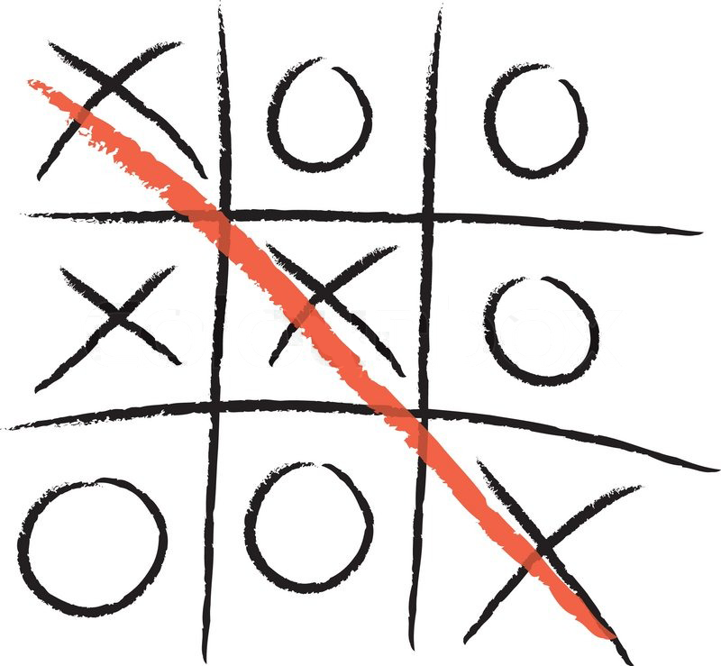
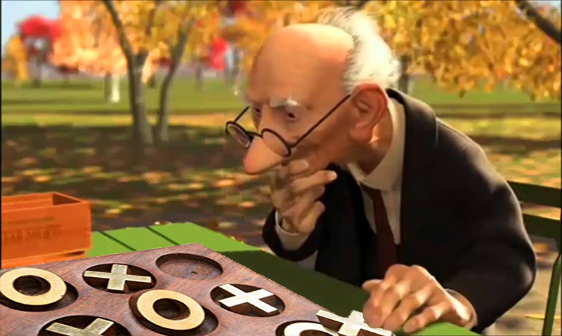

# Exercise - Tic Tac Toe (Part 1)

## The Game

Your task is to create a "Tic Tac Toe" Game. You decide whether you want to make one big method or break it into smaller single purpose methods, and whether you want one class or many classes spread out over many files. You can also consider making configuration files that bring your required files together, run your program or require your gems (if applicable).

### Rules of the Game

1. The goal of the game is to get three in a row
2. The game board is a 3 x 3 grid
3. There are two players, represented by `X` and `O` tokens
4. The player represented by an `X` always goes first
5. Players alternate turns placing their respective `X` and `O` tokens on the grid
6. The game ends when one player has three in a row or all nine squares are filled
7. In the event that no one gets three tokens in a row, it's a stalemate (called a "cat's game")

### Two Ways to Play

#### Version 1 - Two Players

There are two users that take turns in the same terminal on the same computer... sitting next to each other.

#### Version 2 - One Player

Do Not Build This Today

We'll talk about this one in the next exercise. This will require us to build some basic A.I. (artificial intelligence) to act as one of the players. Today, we'll just focus on making the game playable.

# Two Player Game

When building methods, try to make their function simple. If a particular method becomes too complex, you should break it into shorter methods. The complexity may come about because the method is doing 2, 3 or even 12 actions (example, reordering an array and formatting how it is printed to the terminal). Breaking up methods into smaller chunks or using single-responsibility methods can help to build maintainable code. You can always call shorter methods in a longer method to pull their functionality together while keeping each method clean and D.R.Y.

I have made some observations and have asked questions below as a starting guide for this project. Write down your pseudocode on a file that is not included in your app, a sheet of paper or a whiteboard.

### LIMITS

- How many different types of squares are there? (a side square, a corner, the middle)
- What are the possible 3-square-combinations to check for a win? 
(8 possible scenarios)

### Questions

- How do you choose the player that starts?
- How do you decide who is `X` and who is `O`?
- What identifies a turn?
- How do you know when to stop the game?
- Can you identify three in a row? How can you show the user that there is three in a row?

