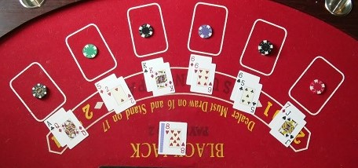

# Exercise - Blackjack

Use the skills that you've built over the last number of weeks to create a full terminal app. Build this app from scratch inside the `blackjack_app` folder using OOP to model a deck of cards and players. Structure your app using the MVP design structure, dividing your app into the appropriate files and folders. You are expected to work on this project over 3 days. The size of this project will require you to Plan, Implement and Evaluate (P.I.E.) multiple times. 

1. Planning is important at the beginning, but will never be complete and you must expect to change the plan mid-project. If you change the plan, be intentional and make sure the whole team is on board before you make a large change.
2. Implementation: There is a lot going on in this app. After making a good plan, divide up the work among your team. If you know the input and output of the methods you are writing, someone can write that individual method and combine it into the bigger app later. (Github workflow works best if you divide the work by files.) You can pair as needed for the more difficult logic. I recommend building the basic structure of folders and files together for about 30 minutes before breaking up the work.
3. You should Evaluate often to verify that your team is on the right path. Check in with your team at designated milestones or times. You should refactor your methods before combining them together.

You'll want to repeat these sections as needed. This is true for any project of a larger scale.

 

-----------------
 

Blackjack is a game of cards using a standard deck of 52 cards in 4 suits ( Suits:`Hearts`, `Diamonds`, `Clubs` and `Spades`), each of which has the following cards ( Values: `2`, `3`, `4`, `5`, `6`, `7`, `8`, `9`, `10`, `Jack`, `Queen`, `King`, `Ace`), and a deck of cards consists of one of each combination ("2 of Hearts", "2 of Diamonds", "2 of Clubs", etc). No Jokers.

In the game Blackjack, the cards have the following values:

- 2-10: The value is the card number
- Jack, Queen and King: Value of 10
- Ace: Value of 1 or 11 (whichever gets you closer to 21 without going over)

# GAME RULES 

Assume there are 4 players (3 computer players and 1 human player). The aim of the game is to win the most money through betting. You win a bet by collecting cards so that the total of an individual player's cards does not exceed 21 in a single hand. At the end of the hand, each player plays against the dealer. Those with a total closest to 21 win the bet.

## Placing your bet

We are playing for fake money called "Doopals". The Dealer works for the house and doesn't ever run out of money. All other players start with Đ500 (or 500 Doopals). Before each hand, each player bets between Đ1 Doopal and Đ100 Doopals against the house.

## Starting a hand

At the start of the hand, the deck is shuffled (i.e. the order of the cards is randomized) and each player is immediately dealt a hand of two cards from the top of the deck (first one face down, the second face up).

## Card Play

Each player, starting with the human player and ending with the dealer, gets to play one turn per hand.

There are multiple hands per game. In a hand, each player takes a turn to play. In a turn, the following rules apply:

- If the computer player's total is less than 17, they "hit" (i.e. get dealt another card from the top of the deck).
- If the computer player's total is 17 or greater, they "stay" (i.e. no longer want another card dealt).
- If any player's total is greater than 21, they "bust" (i.e. lose the game).
- A human player can decide to "hit" or "stay". They can continue to "hit" as long as they have not busted or chosen to "stay".

The hand finishes if:

- All players have decided to "stay" or have a total of 21
- There is only one player left in the hand because all others have gone "bust"

At the end of the hand, each player compares their cards against the dealer. In the comparison, the total closest to 21 wins. Each player receives the amount of the bet placed in their total if they win against the dealer. Each player loses the amount from their total if they lose against the dealer. Players can only play the next hand if they have a positive amount of money to bet with.

The game ends if you choose to leave or there is only one player (not the dealer) with money.
There should be some message that declares a winner and how much money each player has.

#### Optional

The cards can be displayed in an appealing way. Below are some examples

<pre>
Player A's Cards                            | Player B's Cards
=========================================== | ======================================== 
┌───────────┐  ┌───────────┐                | ┌───────────┐  ┌───────────┐
│░░░░░░░░░░░│  │10         │                | │░░░░░░░░░░░│  │ 3         │
│░░░░░░░░░░░│  │           │                | │░░░░░░░░░░░│  │           │
│░RUBY░░░░░░│  │           │                | │░RUBY░░░░░░│  │           │
│░░░BLACK░░░│  │     ♠     │                | │░░░BLACK░░░│  │     ♥     │
│░░░░░░JACK░│  │           │                | │░░░░░░JACK░│  │           │
│░░░░░░░░░░░│  │           │                | │░░░░░░░░░░░│  │           │
│░░░░░░░░░░░│  │         10│                | │░░░░░░░░░░░│  │         3 │
└───────────┘  └───────────┘                | └───────────┘  └───────────┘
                                            |
Your Cards                                  | Dealer's Cards
=========================================== | ========================================
                                            |
┌───────────┐  ┌───────────┐  ┌───────────┐ | ┌───────────┐  ┌───────────┐
│ 2         │  │ K         │  │ A         │ | │░░░░░░░░░░░│  │ K         │
│           │  │           │  │           │ | │░░░░░░░░░░░│  │           │
│           │  │           │  │           │ | │░RUBY░░░░░░│  │           │
│     ♣     │  │     ♥     │  │     ♦     │ | │░░░BLACK░░░│  │     ♣     │
│           │  │           │  │           │ | │░░░░░░JACK░│  │           │
│           │  │           │  │           │ | │░░░░░░░░░░░│  │           │
│         2 │  │         K │  │         A │ | │░░░░░░░░░░░│  │         K │
└───────────┘  └───────────┘  └───────────┘ | └───────────┘  └───────────┘

You have 13, Do you want to..?
  1) Hit
  2) Stay
</pre>

### Bonuses

#### BlackJack

Getting "dealt a blackjack" is when you are only dealt 2 cards, with one being an Ace and the other card having the value of 10 (10, J, Q, K). If you are lucky enough to be dealt this hand, you win an extra 25% more on top of your bet. (Ex: If you bet Đ10, you would win Đ10 + Đ2.5 = Đ12.5) You can keep your total in integers for simplicity to your users; just round up to the nearest whole number.

#### Split

These are the split rules

- You can only split if the cards are of the same value ("Ace and Ace" or "3 and 3")
- You can only split once per hand (no re-splits)
- Once you split, each card is considered its own hand. Your bet is carried to each hand. 

>Example: 
>
>1. You bet Đ10 and draw two 8 cards. 
>2. You split the 8's so that the first hand has a single 8 card and is dealt a second card of 10; your first hand is now 18 and you "stay".
>3. The second hand has your other 8 card from the split and you are dealt a second card of 3. You hit on the second hand and get dealt a Jack, which counts as a 10 - you now have 21 on your second hand and your turn ends.
>4. If the dealer busts you would get back Đ10 x 2 = Đ20.
>5. If the dealer stayed on 20 then you would lose your first hand and win your second hand so your total for the turn is a sum of Đ0. Your total money does not change because the two hands cancel each other out.
