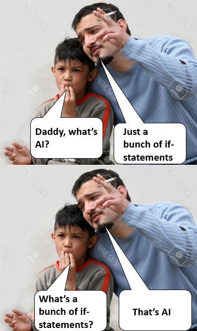
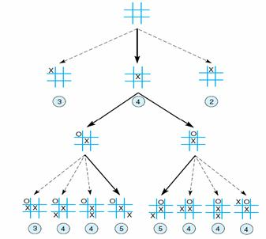

# Exercise - Tic Tac Toe (Part 2)

## Add Artificial Intelligence (A.I.)

This exercise builds on your code from Tic Tac Toe - Part 1. Read through the README.md and add code to your solution from Part 1.

#### Version 2 - One Player

- There is one person playing against the computer. 
- We will make a simple A.I. (artificial intelligence) where the computer can never lose, only win or tie with a cat's game.
- The player will go first if they decide to be `X`. Otherwise, the computer will go first. 

This task is pretty complex, but we can break it into smaller tasks.

## Scenarios

Draw the grid and a possible setup of `X's` and `O's` for any given scenario (where it's true/false). Don't try to do this in your head.

First, we should program the offensive moves. Think of how you would play in different given scenarios. Be specific about the pieces on the board and describe the move you would make, then describe <b>WHY</b> you would make that move. That's what we will code, making the computer act as if a human is playing as an opponent. That's A.I.

>AI: If given these circumstances, then execute this behavior.

Second, we will make the A.I. smarter. The A.I. will not only try to win, but prevent the opponent from winning. The goal is to create A.I. smart enough that it will never lose, and only win or tie against the human player.

#### Offense

My guiding questions to define where the computer should move to win.

- Can this move ever be part of a winning three in a row?
- Can this move win in one move?
- Can this move set up a win on a second move?
- What order should you prioritize these in?

#### Defense

My guiding questions to define where the computer should move to prevent the human player from winning

- Will this square ever be possible for the human player to win?
- Will this square prevent the human player from winning on their next turn?
- Will this square slow down the human player from winning? (leaving the oppertunity for the computer to win before the human player)
- What order should you prioritize these defensive moves in?
- Is the functionality of your offensive moves helpful in finding which moves are a priority for your human opponent?

